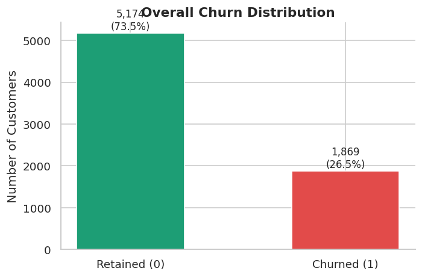
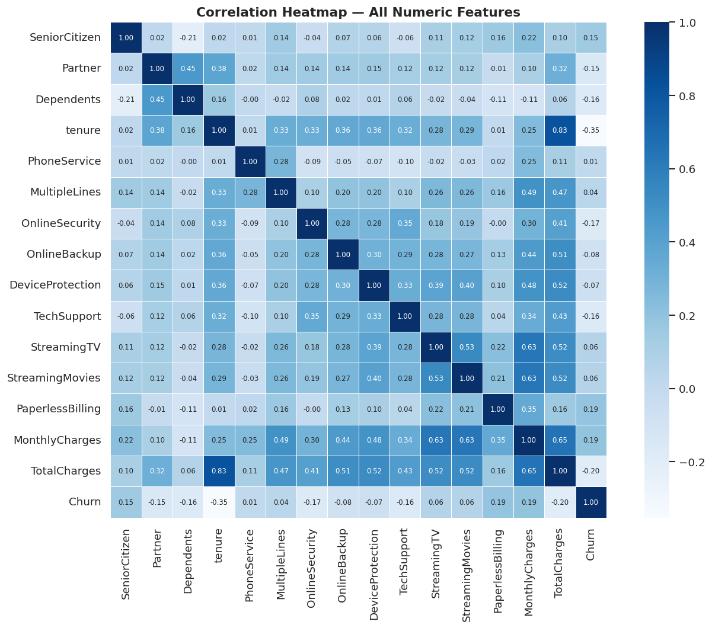
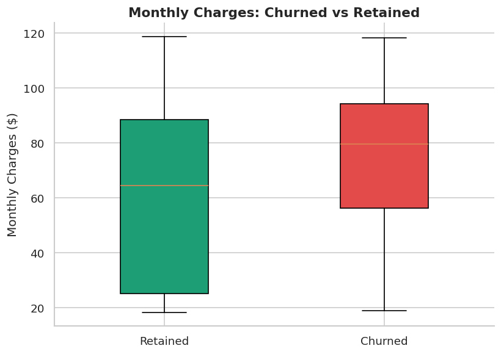

# Customer Churn Prediction

## Problem Statement

Analyzed a telecom dataset of 7,043 customers using Python for preprocessing, exploratory data analysis (EDA), and machine learning to predict customer churn.

## Technical Approach

Data Preprocessing → EDA → Feature Engineering → Random Forest Classifier → Insights

## Installation

### Prerequisites
- Google Colab / Jupyter Notebook
- Dataset from Kaggle

### Libraries
- Pandas  
- Scikit-learn  
- Matplotlib  
- Seaborn  

*(All pre-installed in Google Colab)*

## Usage

### Preprocessing
Run `Customer_Churn_Prediction.ipynb` in Colab to:
- Clean data  
- Handle missing values  
- Engineer features (e.g., tenure groups)

### EDA & Modeling
- Visualize distributions  
- Train Logistic Regression / Random Forest  
- Evaluate model performance  

### Analysis
- Review feature importance  
- Extract business insights  

## Dataset

- **Source:** Kaggle (Telco Customer Churn)  
- **Size:** 7,043 customers × 21 columns  
- **Features:** Demographics, services, billing, churn  

## Data Preprocessing

- Handled missing values (`TotalCharges`)  
- One-hot encoding for categorical variables  
- Feature engineering: tenure groups (0–12, 13–24, etc.)  

## Exploratory Data Analysis

- Churn distribution (**26.5% churn rate**)  
- Correlation heatmap  
- Monthly charges vs churn (boxplot)  

## Machine Learning Pipeline

- Train/Test Split: **80/20**  
- Model: **Random Forest Classifier**  
- Accuracy: **75%**  

### Evaluation Metrics
- Precision  
- Recall  
- F1-score  

## Key Drivers of Churn

1. InternetService_Fiber optic  
2. TenureGroup_Long
3. PaperlessBilling
4. PaymentMethod_Electronic check
5. MonthlyCharges 

## Visualizations

- Churn distribution  
- Correlation heatmap  
- Boxplots  

## Conclusion

This model helps identify high-risk customers and supports retention strategies. Effective preprocessing and EDA improved prediction accuracy.

## Business Recommendations

- **Month-to-month contracts:** Offer discounts for long-term plans  
- **Fiber optic users:** Improve service or provide bundled offers  
- **High monthly charges:** Introduce tiered pricing or value-added services  

## Skills Used

- Python (Pandas, Scikit-learn)  
- Machine Learning  
- Feature Engineering  
- Exploratory Data Analysis (EDA)  
- Model Evaluation  
License
MIT License.

Author
Sneha
GitHub:https://github.com/snss02

MIT License. Feel free to use, modify, and distribute.
